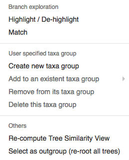
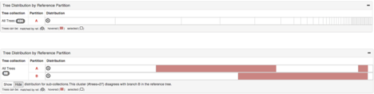
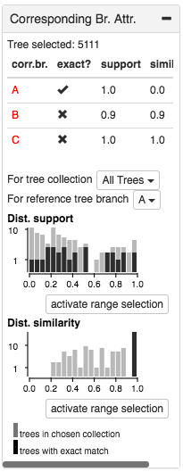

VisPhy: Visual Comparison of Phylogenetic Trees
====

Visually compare a reference phylogenetic tree against some other phylogenetic trees with roughly the same set of taxa to check support and conflict of reference.  

Potential comparisons:
* A species tree vs. gene trees
* A species / gene tree vs. its bootstrapping trees  
* A species tree vs. other species trees generated by different inference methods, parameter settings, filtering criteria, etc
* A gene tree vs. other gene trees


What VisPhy is NOT for
----

* Visual presentation of one phylogenetic tree 
* Statistical analysis of phylogenetic hypotheses
* Rigorous analysis of branch lengths in trees (we focus on topology and taxon memberships)

What VisPhy cannot deal with currently but might be able to in the future?
----

* Duplicates (paralogs)
* Current data scale: #nodes < 150 (for best visual effects), #trees < 1000.  This numbers are for best visual effects and 
performance, but there is no hard limit.  Dataset larger than this can still be processed, but the interface might be slow and require a lot of mouse scrolling.


A Short Walk-through of VisPhy
----


We demonstrate VisPhy interface with a sampled dataset from [the 1KP pilot study](https://gigascience.biomedcentral.com/articles/10.1186/2047-217X-3-17).
We compare a species trees inferred using [ASTRAL](https://github.com/smirarab/ASTRAL) with 100 sampled gene trees.
We do not assume phylogenetic plausibility of this dataset, but only use it for demonstration.

The reference tree (a) is shown on the left, with distributions of branch attribute values (a1) and a detailed dendrogram.
The purple background range slider in the support value histogram highlights the branches that fall into it in the 
dendrogram below with purple thick lines.  Here, we have selected three **named branches** A, B and C.

We show different aspects of the tree collection on the right.  The tree distribution view (b) shows how trees are binned
by the local **taxa membership** of A, B, and C respectively.  The aggregated dendrograms (AD for short) (c) tells the 
relationships among A, B and C with a much simpler and smaller form of dendrogram.  
According to the cluster ADs (c1), there are basiclly three different kinds of relationships:
`(A,(B,C))`, `(C,(A)B)` and `(B,C)` (all taxa in A is missing from that gene tree), while almost all trees have the first kind.
Within each cluster, the "backbone" connections among A, B and C are the same, but the groupings of other taxa outside
of the named clades can be different.
You can also see each individual tree as a AD in (c2), and pairwsie compare it with the reference tree in details, as
shown in the figure below.

Auxiliary views (d) include a list of the tree (gene) names, a list of taxon names, 
tree similarity which projects each tree to a dot in a two dimensional space for a sense of tree distances, and 
distribution of branch attribute values of the corresponding branches (defined as the the closest or the most similar branch
of a tree in the tree collection to a named branch in the reference).


Comparison Computation
----

For each branch in the reference tree, we find the the most similar branch in each tree of the tree collection, which
we call **corresponding branch**.  As we focus on taxa memberships, the similarity function is the 
[Jaccard Index](https://en.wikipedia.org/wiki/Jaccard_index)
of two sets of taxa, one from the reference tree, one from the tree collection.

If trees have missing taxa, we calculate the jaccard function after excluding the missing from the two sets.

```
Similarity(A, Reference, B, Tree) = JaccardIndex(A - Tree.missing, B - Reference.missing)
```

`A` is a monophyletic set of taxa in `Reference`, and `B` also a monophyletic set of taxa in `Tree`.  
`Reference.missing` is the set of missing taxa from the reference tree, which is usually none.
`Tree.missing` is the set of missing taxa from `Tree` in the tree collection, which is usually not none for a gene tree.

If there exists a monophyly `B` in `Tree` such that `Similarity(A, Reference, B, Tree) = 1`, we denote `B` as an
**exact match** in `Tree` for reference branch `A` (branch and monophyletic taxa set is used interchangeablly here).
If `B` is the the branch with the highest similarity but does not score 1, it is considered an **inexact match**.
The concept of exactness is crucial when you are looking for support or conflict evidence for a reference branch.

> Caveat: The exact match only says it has the same **set** of taxa, but not necessarily the same **topology** within.
> So does the inexact match.


Reference Tree
----

We show the distribution of support values in the reference tree (if provided), and of the percentage of exact match,
which is also called gene support frequency (GSF) in some phylogenetic literature.  A branch with high GSF means that
there are lots of trees that has the same (in terms of taxa membership) monophyly in the tree collection, which can be
a signal that this branch is strongly supported.  You can drag the slider handle to customize the range of either attribute
to find interesting branches for investigation. 



In the reference dendrogram, you can do `alt+click` on a branch to bring up a menu as shown above:

* Highlight (shortcut: `click`):
  - color the descendants in the reference tree and pairwise comparing tree (if any); 
  - color the taxa in the aggregated dendrograms.  
* Match (shorcut: `command+click` on Mac, `ctrl+click` on Windows): 
  - find the corresponding branch in each tree of the tree collection; 
  - put trees into bins by the taxa membership under their corresponding branches and render a bar segment gragh in the Tree Distribution view;
  - separate the named monophyly from the rest of the tree in the aggregated dendrograms; 
  - update the distribution of attribute values of corresponding branches
* Actions related to user specified taxa group (create, add, remove from, delete): 
  - manage a taxa group specified by user, usually a paraphyletic group (as you can match monophyletic group by the action above)
* Re-compute tree similarity: 
  - re-calculate the distance between trees to be the the local similarity (Jaccard Index) instead of the 
    global similarity (Robinson-Foulds distance);
  - re-arrange dots in the tree similarity view.
* Re-root: 
  - pick this monophyly or taxa as the outgroup;
  - re-root the trees
  - redo corresponding branch calculation

When you are comparing a tree with the reference tree, it is displayed as a "butterfly" style of dendrograms, named clades
are both trees are highlighted with the same color for easy lookup.  If you hover on a taxon, you are able to see where it 
is in the other tree. You can also click the branch to highlight more clades, but with a limit of 5 colors.


Tree Distribution
----



Tree distribution shows how trees distributed according to reference branches of interest.  Once a reference branch is 
matched, the taxa members under the matching branch in the tree collection are examined and put into bins (segments).  
Within a segment, trees share the same set of taxa under their matching branches, and different across segments.  
First segment with an reference “R” mark represents the segment which shares the same taxa group as the reference tree, 
and following that, conflicting trees sorted by popularity.

You can hover on the segment to see where the trees in other segmentation, which is a useful tool to check interaction 
effect across different branches.  For example, in the figure above, all trees in the second segment of B (the most 
popular conflicting trees for B) also disagree with A (not a single tree fall in the first segment of A), which might 
suggest interesting interaction between branch A and B.

TODO: membership inspection

Aggregated Dendrogram
----

TODO

Auxiliary Views
----

#### Tree Similarity


The dot plot in the tree similarity shows an overview of trees in the dataset.  Each dot represent a tree, 
and the distance between dots represent the distance of trees, be it global RF distance or local Jaccard Index similarity measure.  
The absolute coordinate of a dot does not matter, but the relative distance does.  Similar dots (with shorter tree distance) 
tend to stick together or nearby, while different ones stay away.  The 2D coordinates is dimensionally reduced from the 
distance matrix of trees using [t-SNE](https://lvdmaaten.github.io/tsne/), 
and hence might not capture difference between any pair of trees.  Besides, given 
the limited screen space, this view is subject to visual clutter if the number of dots exceeds 200.

#### Corresponding Branch Attribute



There are branch attributes such as support values associated to the the matching branches, which are also important to check.  
You can see details of these values for an individual tree by hovering on the AD or the distribution of them in 
the histograms on the right side.  Grey background bars represent all the matching branches, while the black foreground 
ones represent exact matches.  
Similar to the branch attribute histograms for the reference tree, you can interact with these charts by selecting a range.

You can change the scope of trees or the reference branch from the menu.

#### Tree List


#### Taxa List 


Tree Selection
----


How to export figures
----


How to upload your own data
----


