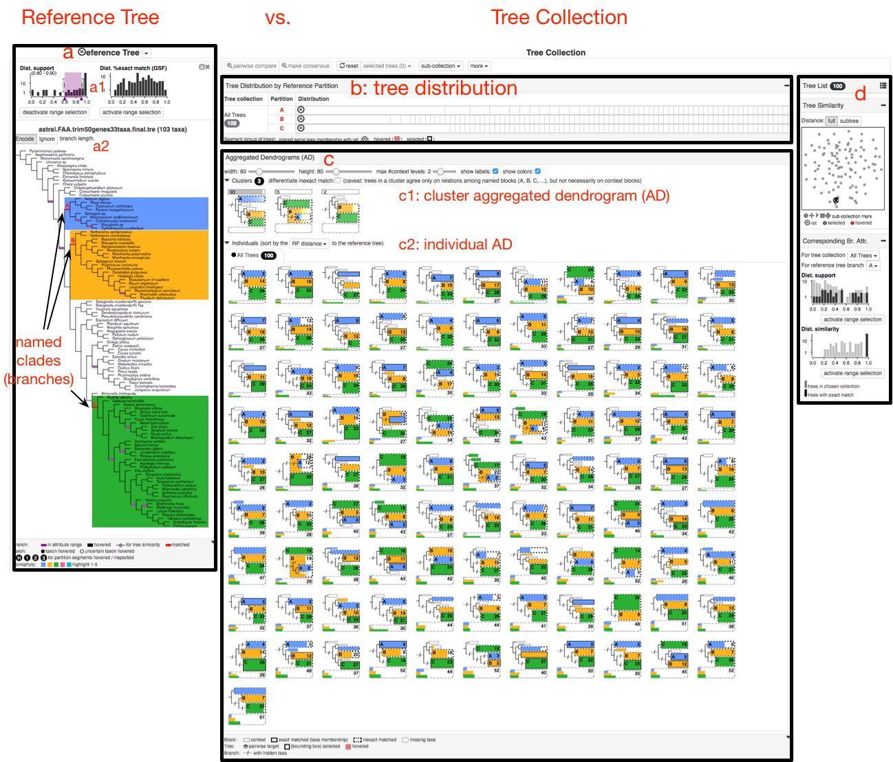
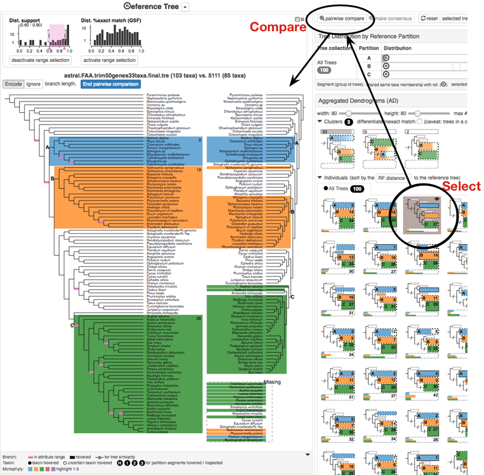

VisPhy: Visual Comparison of Phylogenetic Trees
====

Visually compare a reference phylogenetic tree against some other phylogenetic trees with roughly the same set of taxa to check support and conflict of reference.  

Potential comparisons:
* A species tree vs. gene trees
* A species / gene tree vs. its bootstrapping trees  
* A species tree vs. other species trees generated by different inference methods, parameter settings, filtering criteria, etc
* A gene tree vs. other gene trees

What VisPhy is NOT for
----

* Visual presentation of one phylogenetic tree 
* Statistical analysis of phylogenetic hypotheses
* Rigorous analysis of branch lengths in trees (we focus on topology and taxon memberships)

What VisPhy cannot deal with currently but might be able to in the future?
----

* Duplicates (paralogs)
* Current data scale: #nodes < 150 (for best visual effects), #trees < 1000.  This numbers are for best visual effects and 
performance, but there is no hard limit.  Dataset larger than this can still be processed, but the interface might be slow and require a lot of mouse scrolling.

A Short Walk-through of VisPhy
----

We demonstrate VisPhy interface with a sampled dataset from [the 1KP pilot study](https://gigascience.biomedcentral.com/articles/10.1186/2047-217X-3-17).
We compare a species trees inferred using [ASTRAL](https://github.com/smirarab/ASTRAL) with 100 sampled gene trees.
We do not assume phylogenetic plausibility of this dataset, but only use it for demonstration.

The reference tree (a) is shown on the left, with distributions of branch attribute values (a1) and a detailed dendrogram.
The purple background range slider in the support value histogram highlights the branches that fall into it in the 
dendrogram below with purple thick lines.  Here, we have selected three **named branches** A, B and C.

We show different aspects of the tree collection on the right.  The tree distribution view (b) shows how trees are binned
by the local **taxa membership** of A, B, and C respectively.  The aggregated dendrograms (AD for short) (c) tells the 
relationships among A, B and C with a much simpler and smaller form of dendrogram.  
According to the cluster ADs (c1), there are basiclly three different kinds of relationships:
`(A,(B,C))`, `(C,(A)B)` and `(B,C)` (all taxa in A is missing from that gene tree), while almost all trees have the first kind.
Within each cluster, the "backbone" connections among A, B and C are the same, but the groupings of other taxa outside
of the named clades can be different.
You can also see each individual tree as a AD in (c2), and pairwsie compare it with the reference tree in details, as
shown in the figure below.

Auxiliary views (d) include a list of the tree (gene) names, a list of taxon names, 
tree similarity which projects each tree to a dot in a two dimensional space for a sense of tree distances, and 
distribution of branch attribute values of the corresponding branches (defined as the the closest or the most similar branch
of a tree in the tree collection to a named branch in the reference).

Reference Tree View
----

