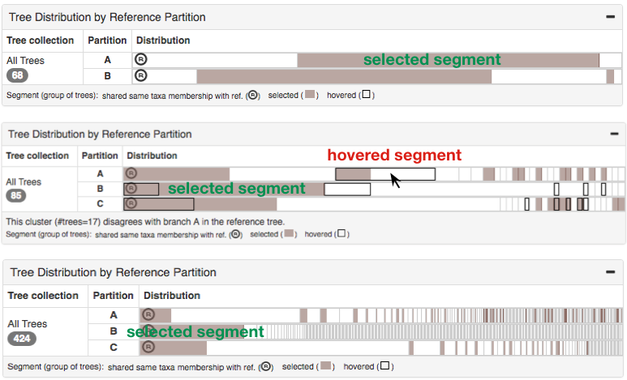

VisPhy: Visual Comparison of Phylogenetic Trees
====

Documentation Author: [Zipeng Liu](http://www.cs.ubc.ca/~zipeng/)
Website: [vipshy.cs.ubc.ca](http://visphy.cs.ubc.ca)

## 1 Overview

### 1.1 What is VisPhy

Visually compare a reference phylogenetic tree against some other phylogenetic trees with roughly the same set of taxa to check support and conflict of reference.  

Potential comparisons:
* A species tree vs. gene trees
* A species / gene tree vs. its bootstrapping trees  
* A species tree vs. other species trees generated by different inference methods, parameter settings, filtering criteria, etc
* A gene tree vs. other gene trees


### 1.2 What VisPhy is NOT for

* Visual presentation of one phylogenetic tree 
* Statistical analysis of phylogenetic hypotheses
* Rigorous analysis of branch lengths in trees (we focus on topology and taxon memberships)

### 1.3 What VisPhy cannot deal with currently but might be able to in the future?

* We cannot deal with paralogs.  If a tree contains duplicate copies of a taxon, which are identified by the same label, the pre-processor will fail.
If they have different labels such as "A_1" and "A_2", you need to be alert that we treat them as they were orthologs: "A_1" in a tree
can only match "A_1" in another tree, not "A_2" or "A".
* Current data scale: #nodes < 150 (for best visual effects), #trees < 1000.  These numbers are for best visual effects and 
performance, but there is no hard limit.  Dataset larger than this can still be processed, but the interface might be slow and require a lot of mouse scrolling.


## 2 A Short Walk-through

Figure 1


We demonstrate VisPhy with a sampled dataset from [the 1KP pilot study](https://gigascience.biomedcentral.com/articles/10.1186/2047-217X-3-17).
We compare a species trees inferred using [ASTRAL](https://github.com/smirarab/ASTRAL) with 100 sampled gene trees.
We do not assume phylogenetic plausibility of this dataset, but only use it for demonstration.

As shown in Fig.1, the reference tree \[R\] is shown on the left, with distributions of branch attribute values \[R-1\]
and a detailed dendrogram \[R-2\].
The pink background range slider in the support value histogram \[R-1\] highlights the branches that fall into it in the 
dendrogram below with pink thick lines.  

Here, we have selected three **named branches** A, B and C, whose clade is highlighted in blue, orange, and green.
We show different aspects of the tree collection \[TC\] on the right.
The aggregated dendrograms (AD) in the view \[TC-AD\] tells the relationships among A, B and C 
with a much simpler and smaller yet meaningful form of dendrogram.  
We find the closest monophyly to A, B and C in each tree (called matches), which is displayed as a block in the AD,
and elide everything else except some nearby clades as their context information.
As it still requires quite a lot cognitive effort to browse and compare dozens or hundreds of ADs in \[TC-AD-2\],
we cluster all ADs according to the relationships among their named clades.
In \[TC-AD-1\], it clearly shows that there are basically three different kinds of relationships:
`(A,(B,C))`, `(C,(A)B)` and `(B,C)` (all taxa in A is missing from that gene tree), 
while almost all trees are of the first kind.
Within each cluster, the "backbone" connections among A, B and C are the same, but the groupings of other taxa outside
of the named clades can be different since we consider this context information irrelevant.

While AD tells the connection **among** named clades, the tree distribution \[TC-TD\] is for taxa membership **within**
named clades.  Each row shows how trees are binned by the local **taxa membership** of a specific named clade
with partial segments.  A segment represents a subset of trees that share the same set of taxa (but not necessarily
the same topology), and the first segment with a circled "R" mark represents the subset that agrees with the reference
tree.  Long tail is often observed because of different missing taxa across gene trees.

Figure 2


To check which set of taxa a segment agrees on, you can use the "taxa membership inspection" (alt+click a segment to bring
out a menu), as shown in Fig. 2 (a).  An aligned column of dots in the reference tree points out the taxa group shared 
by a numbered segment.  We are inspecting three segments in Fig.2, which is convenient way to compare alternative 
taxa group to the reference.

If you hover a segment, you can see where are these trees distributed by other named clades and also their ADs with 
black border (Fig. 2 (b)).  You can also click a segment or a cluster AD to select a subset of trees, which highlights
those trees in other distributions in brown background (Fig. 2 (c)).  This highlight mechanism can reveal some 
phylgenetic interaction between different genes, which might become an interesting topic for you to study later,
such as the subset of trees that agrees with reference on one clade has different groupings for another clade.
Along with the cluster AD and sub-collection management (introduced later in 4.5), you are able to find trees by
various criteria.


Figure 3


It is always necessary to see a specific tree in details on demand.  Once you select a target tree, you can pairwise
compare it with the reference tree with a taxon-to-taxon "butterfly" view, as illustrated in Fig. 3.  Taxa in named
clades are colored accordingly, and hovering on a taxon in one tree triggers a pointer to the same taxon in the other
tree.

Auxiliary views include a list of the tree (gene) names, a list of taxon names, 
tree similarity (\[TC-TS\] in Fig. 1) which projects each tree to a dot in a two dimensional space 
for a sense of tree distances, and 
distribution of branch attribute values of the closest matched branches (\[TC-CBAE\] in Fig. 1).

## 3 Matching Computation

Here we describe the computation for matching branches between the reference tree and a tree in the tree collection.
For each branch in the reference tree, we find the the most similar branch in each tree of the tree collection, which
we call **corresponding branch**.  As we focus on taxa memberships, the similarity function is the 
[Jaccard Index](https://en.wikipedia.org/wiki/Jaccard_index)
of two sets of taxa (intersection over union), one from the reference tree, one from the tree collection.

If trees have missing taxa, we calculate the Jaccard function after excluding the missing from the two sets.

```
Similarity(A, Reference, B, Tree) = JaccardIndex(A - Tree.missing, B - Reference.missing)
```

`A` is a monophyletic set of taxa in `Reference`, and `B` also a monophyletic set of taxa in `Tree`.  
`Reference.missing` is the set of missing taxa from the reference tree, which is usually none.
`Tree.missing` is the set of missing taxa from `Tree` in the tree collection, which is usually non-zero for a gene tree.

An **exact match** in `Tree` for reference branch `A` is found if there exists
a monophyly `B` in `Tree` such that `Similarity(A, Reference, B, Tree) = 1`
 (branch and monophyletic taxa set is used interchangeablly here).
An **inexact match** is the highest scored one if there does not exist an exact match.
The concept of exactness is crucial when you are looking for support or conflict evidence for a reference branch.

> Caveat: The exact match only says it has the same **set** of taxa, but not necessarily the same **topology** within.
> So does the inexact match.


## 4 Details

We introduce each components in details.

### 4.1 Reference Tree

In Fig. 4, We show the distribution of support values in the reference tree (if provided), and distribution of the 
percentage of exact match,
which is also called gene support frequency (GSF) in some phylogenetic literature.  A branch with high GSF means that
there are lots of trees that has the same (in terms of taxa membership) monophyly in the tree collection, which can be
a signal that this branch is strongly supported.  You can drag the slider handle to customize the range of either attribute
to find interesting branches for investigation.  For example, in Fig. 4, we highlighted all branches whose support is in
\[0, 0.7\] in pink.  Hovering on a branch displays a tooltip showing every attributes 
of that branch at the upper right corner.

Figure 4


In the reference dendrogram, you can hit `alt+click` on a branch to bring up a menu (see Fig. 4):

* Highlight (does NOT create a named clade) (shortcut: `click`):
  - color the descendants in the reference tree and pairwise comparing tree (if any); 
  - color the taxa in the blocks of aggregated dendrograms.  
* Match (create a new named clade) (shortcut: `command+click` on Mac, `ctrl+click` on Windows): 
  - find the corresponding branch in each tree of the tree collection; 
  - put trees into bins by the taxa membership under their corresponding branches and add a row in the tree distribution (\[TC-TD\] in Fig. 1);
  - change the layout of ADs to reflect the new named clade;
* Actions related to user specified taxa group (create, add, remove from, delete): 
  - manage a taxa group specified by user, usually a paraphyletic group (as you can already match monophyletic group 
  with the action above)
* Re-compute tree similarity: 
  - re-calculate the distance between trees to be the local similarity (Jaccard Index) instead of the 
    global similarity (Robinson-Foulds distance);
  - re-arrange dots in the tree similarity view.
* Re-root: 
  - pick this monophyly or taxa as the outgroup;
  - re-root all trees
  - redo corresponding branch calculation

We have a limit of 5 highlight colors: blue, orange, green, red, purple, in order to maintain obvious perceptual 
difference in both the reference tree and the ADs.  We reuse these colors in a circular way once there are too many 
clades to highlight, which is not recommended.


### 4.2 Tree Distribution

Figure 5



Tree distribution shows how trees distributed according to reference branches of interest (named branches). Once a reference branch is being matched, 
the taxa members under the matching branch in the tree collection are examined and put into bins (segments).  Within a 
segment, trees share the same set of taxa under their corresponding branches, and different across segments.  First segment with the circled “R” mark represents the segment which shares the same taxa group with the reference tree, 
and following that, conflicting trees sorted by popularity.

You can hover or select on the segment to highlight where the trees in other segmentation, 
which is a useful tool to check interaction effect across different branches.  For example, in Fig. 5 top, all trees in 
the second segment of A (the most 
popular conflicting trees for A) also disagree with B (not a single tree fall in the first segment of B), which might 
suggest interesting interaction between branch A and B.
In Fig. 5 middle, some segments are partially browned due to the selection of the first segment of B, and some are
partially highlighted by black border due to the hovered segment pointed by the mouse.
In Fig. 5 bottom, there are more than 400 gene trees in the dataset, where you can clearly see the typical long tail
effect for tree distribution.

Figure 6


We put trees into bins and we also tell you why they are binned together: their corresponding branches share the same 
set of taxa under them.  What taxa is in this set?  You can either hover on a segment, which gives you circle markers 
next to the taxa labels in the reference tree, or alt+click a segment and select "inspect taxa membership" to persist
these markers even when you move away your mouse (Fig. 6).  Persisting the taxa membership markers can help with 
comparing multiple segments (different sets of taxa).  If you persist the markers, labels in the reference tree are 
aligned to the right side for a cleaner view of markers (Fig. 6 top is unaligned, while bottom is aligned).

Usually the tree distribution is used together with the aggregated dendrograms and pariwise comparison to understand
why certain trees do not agree with the reference.


### 4.3 Aggregated Dendrogram

#### 4.3.1 Layout

#### 4.3.2 Visual Elements

For inexact match, there are a few cases that could possibly have happened:

* Some taxa are missing from a tree, so they are missing from that corresponding clade (the clade under a corresponding branch).
* The taxa in the named clade (monophyly) of the reference tree are paraphyletic in the trees that belong to this segment.
* Some taxa in the named clade of the reference tree are closer to others, which gets them "kicked out".
* There are "intruders" getting into the corresponding clade.

TODO: show figures for each of these cases

### 4.4 Auxiliary Views

#### 4.4.1 Tree Similarity

Figure 7


The dot plot in the tree similarity shows an overview of trees in the dataset.  Each dot represents a tree, 
and the distance between dots represents the distance of trees, which you can pick between 
global RF distance or local Jaccard Index similarity measure (you have to select a branch using alt+click on a specific reference branch).  
The absolute coordinate of a dot does not matter, but the relative distance does.  Similar dots (with shorter tree distance) 
tend to stick together or nearby, while different ones stay away.  The 2D coordinates is dimensionally reduced from the 
distance matrix of trees using [t-SNE](https://lvdmaaten.github.io/tsne/) (a non-linear dimension reduction technique), 
and hence might not capture difference between any pair of trees.  Besides, given 
the limited screen space, this view is subject to visual clutter if the number of dots exceeds 200.

#### Corresponding Branch Attribute


There are branch attributes such as support values associated to the the matching branches, which are also important to check.  
You can see details of these values for an individual tree by hovering on the AD or the distribution of them in 
the histograms on the right side.  Grey background bars represent all the matching branches, while the black foreground 
ones represent exact matches.  
Similar to the branch attribute histograms for the reference tree, you can interact with these charts by selecting a range.

You can change the scope of trees or the reference branch from the menu.

#### 4.4.2 Tree List

A list of tree names.  Selected trees and hovered trees are shown with the same visual effect as other views 
(brown background and black border).

#### 4.4.3 Taxa List 

A list of taxa names sorted in alphabetical order.  Hovering on a taxon name will trigger the corresponding marker
in the reference tree, telling you where is that taxon.

### 4.5 Tree Selection

TODO

### 4.6 How to export figures

You might want to select the "expand the full web page" inside the "more" button on the top so that
the web page scrolls as a whole instead of scrolls within their own views.  Then you can use any snapshot / screenshot
tool for your operating system or browser to do a full page screenshot.

If you are using Chrome, you can use an extension called "Full Page Screen Capture" (it has Pacman animation!).

You cannot export a vector graph now, nor arrange the view layout as you like.  We are working on that and hopefully
we can get better in exporting publication friendly figures.

## 5 How to upload your own data

There is a page to upload your own dataset (on the top navigation bar).

A typical dataset consists of:

* A newick file for the reference tree
* A newick file for the tree collection, with one tree per line
* A file for names of trees in the tree collection with the same order in the newick file (optional)
* Outgroup taxa if trees are unrooted (you will be able to specify after submitting the three files above)


